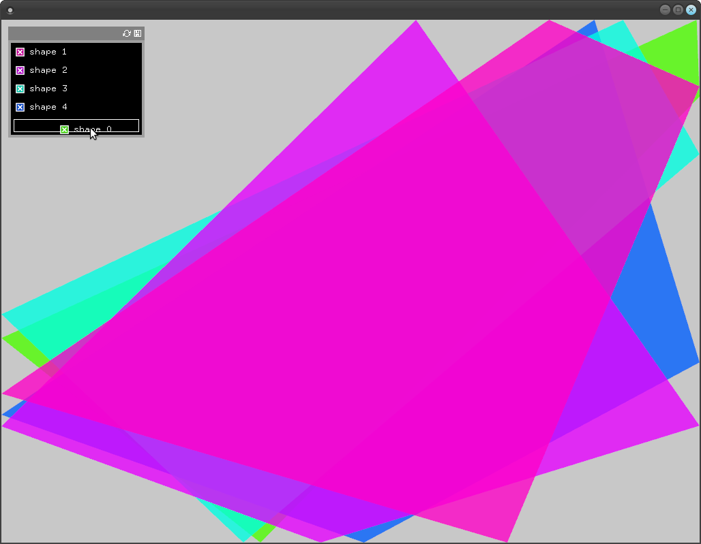

# About togglelistParameters

### Learning Objectives
This example demonstrates how this addon can be used to sort and destroy toggles that are linked to your drawings. Pay special attention to how the toggle parameters are stored and accessed in a parameter group.

### Expected Behavior

When you open the app, you should see a screen with a panel and five random sized and colored shapes. In the panel is a toggle for each shape, signed by the background color that fits to the shape. If you switch the toggle, the shape will appear and disappear. By changing the toggle order you can also change the drawing order of the shapes.

### Classes Used in This File

This example also uses:

	ofParameter
	ofParameterGroup
